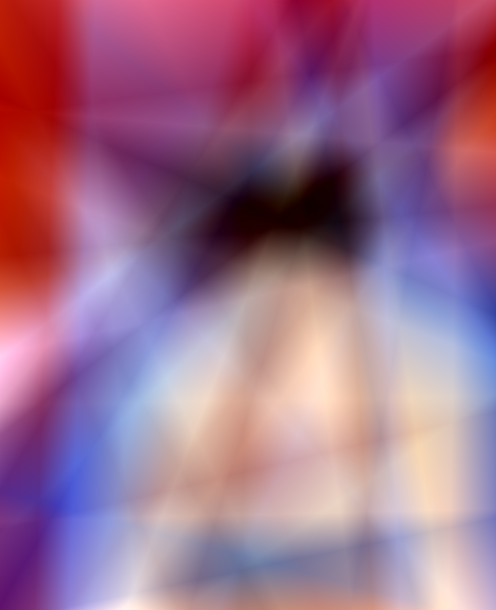
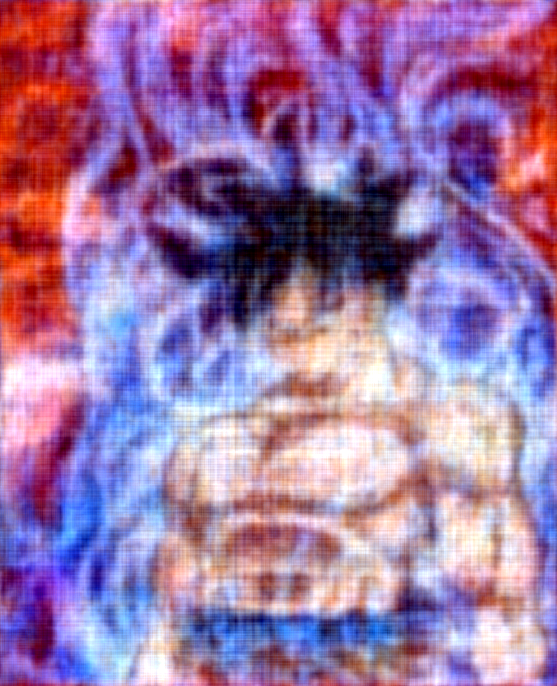

# NeRF

A simple toy example to play around with NeRFs. Here I render simple 2d images. Inspired by this talk: https://youtu.be/HfJpQCBTqZs <br>
The goal of this repo is to get familiar with NeRFs using a toy problem and to create a template in pytorch-lightning that can be used to aid further research on the subject.

## Dependencies

* python 3.9
* torch==1.3.1
* pytorch_lightning==2.0.0
* Pillow==9.4.0
* configargparse

## Build from Source

1) Clone this repostiory. <br>
   `git clone https://github.com/dv-fenix/NeRF.git` <br>
   `cd NeRF`

2) Create a conda environment for the experiments. <br>
   `conda create --name toy_nerf` <br>
   `conda activate toy_nerf`

3) Install requirements listed in `requirements.txt`. <br>
   `pip install --upgrade pip` <br>
   `pip install -r requirements.txt`

## Quick Tour

To train the 2d NeRF as per the original proposal (w/o positional encodings), you can run the following script
```python
python -m src.train \
    --inp_path <path_to_image> \
    --save_dir ./expts/no_position \
    --log_dir ./expts/logs \
    --save_last \
    --num_workers 0 \
    --lr 1e-4 \
    --check_val_every_n_epoch 100 \
    --epochs 400
```

In order to run the experiment with position encodings, just add the `--use_positional_encoding` flag at the end of the script and change the expt directory accordingly.

## Results

Training the NeRF without position encodings produces the following results (see img on right).
<table><tr>
<td>  </td>
<td>  </td>
</tr></table>

Training the NeRF with position encodings produces the following results (see img on right).
<table><tr>
<td>  </td>
<td>  </td>
</tr></table>

As expected, the results of the second experiment are much sharper. One can further improve the rendering to look almost realistic by simply increasing the size of the model. My recommendation, do so intelligently and use techniques such as batch noramlization while scaling.
