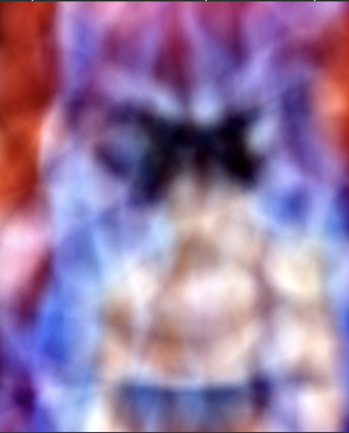
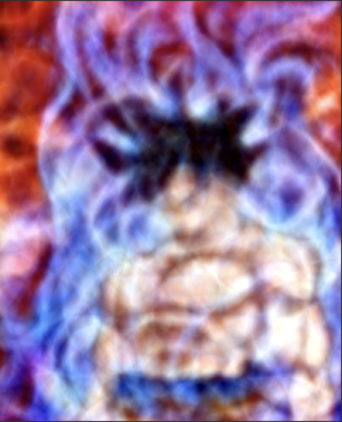

# NeRF

A simple toy example to play around with NeRFs. Here I render simple 2d images. Inspired by this talk: https://youtu.be/HfJpQCBTqZs <br>
The goal of this repo is to get familiar with NeRFs using a toy problem and to create a template in pytorch-lightning that can be used to aid further research on the subject.

## Dependencies

* python 3.9
* torch==1.3.1
* pytorch_lightning==2.0.0
* Pillow==9.4.0
* configargparse

## Build from Source

1) Clone this repostiory. <br>
   `git clone https://github.com/dv-fenix/NeRF.git` <br>
   `cd NeRF`

2) Create a conda environment for the experiments. <br>
   `conda create --name toy_nerf` <br>
   `conda activate toy_nerf`

3) Install requirements listed in `requirements.txt`. <br>
   `pip install --upgrade pip` <br>
   `pip install -r requirements.txt`

## Quick Tour

To train the 2d NeRF as per the original proposal (w/o positional encodings), you can run the following script
```python
python -m src.train \
    --inp_path <path_to_image> \
    --save_dir ./expts/no_position \
    --log_dir ./expts/logs \
    --save_last \
    --num_workers 0 \
    --lr 1e-4 \
    --check_val_every_n_epoch 100 \
    --epochs 400
```

In order to run the experiment with learnable position encodings, just add the `--learnable_positional_encoding` flag at the end of the script and change the expt directory accordingly.

## Results

Training the NeRF without position encodings produces the following results (see img on right).
<table><tr>
<td>  </td>
<td>  </td>
</tr></table>

Training the NeRF with sinusoidal position encodings produces the following results (see img on right).
<table><tr>
<td>  </td>
<td>  </td>
</tr></table>

### Update (15 April 2023)

Training the NeRF with random fourier features produces the following results (see img on right).
<table><tr>
<td>  </td>
<td>  </td>
</tr></table>

Training the NeRF with learnable position encodings produces the following results (see img middle). The img on the right is the same experiment, but with a larger volume of learnable encodings.
<table><tr>
<td>  </td>
<td>  </td>
<td>  </td>
</tr></table>

## Remarks

As expected, allowing the NeRF to learn it's own positional encodings improves the visual quality. I naively increased the number of such encodings to check the impact of that excercise on image quality. The result, slightly better visual renderings, but not perfect.

A combination of learned positional encodings along with a slightly larger network should result in realistic outputs. I was too lazy to try that out since I would not have been able to train that network on my Macbook efficiently. Feel free to try that out. My recommendation, do so intelligently and use techniques such as batch noramlization while scaling.
